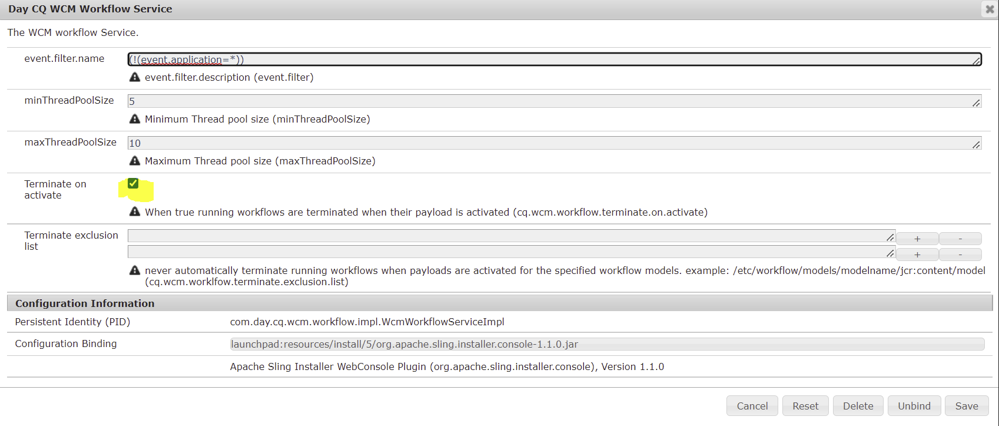

# Impedir la terminación automática del flujo de trabajo de publicación programada

## Descripción

Cómo evitar la terminación automática del flujo de trabajo de publicación programada si los recursos de la carga útil se publican manualmente

Pasos para duplicar :

1. Seleccione cualquier página de AEM Sites que tenga recursos no publicados (imágenes)

2. Haga clic en Administrar publicación

3. Seleccionar más tarde: seleccione una fecha futura

4. Haga clic en Siguiente : seleccione la página

5. Haga clic en Siguiente - Introduzca el título del flujo de trabajo (p. ej. Publicar más tarde)

6. Ahora vaya a Herramientas - Flujo de trabajo - Instancias

7. Puede encontrar el trabajo que ha programado para activarse más adelante con el título &quot;Publicar más tarde&quot;.

8. Seleccione el trabajo - Haga clic en &quot;Carga útil&quot;

9. Se abrirá una nueva ficha en la que se encontrarán la página y los recursos que están programados para su activación.

10. Ahora active manualmente el recurso presente en la carga útil

11. Ahora vaya a Herramientas - Flujo de trabajo - Archivos

12. Podría notar que el trabajo &quot;Flujo de trabajo programado&quot; (Publicar más tarde) estará en estado Anulado

## Resolución

Para desactivar la terminación automática de la publicación programada, &quot;desmarque&quot; la opción &quot;Terminar en publicación&quot; en &quot;Servicio de flujo de trabajo Day CQ WCM&quot; en la configuración OSGi. (consulte captura de pantalla)

