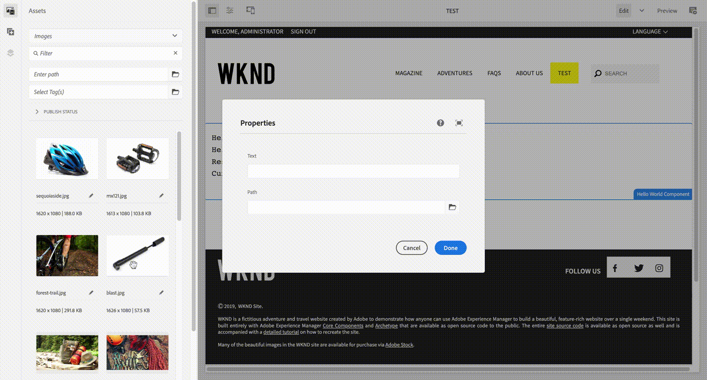
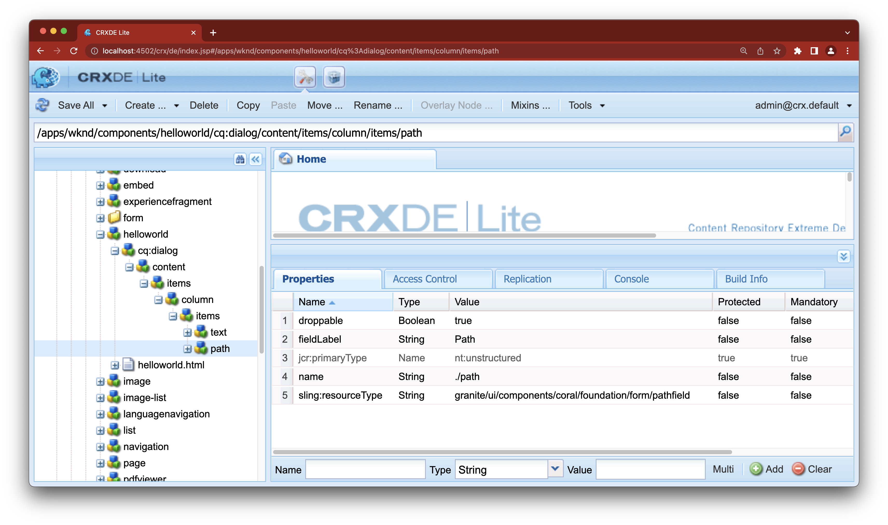

# Adobe Experience Manager: Cómo habilitar la función de arrastrar y soltar un recurso en un PathField.

## Descripción


Desde AEM 6.5.10, puede arrastrar y soltar un recurso del explorador de recursos en un PathField en el editor de páginas.
Este artículo explica cómo habilitar esta función.



Esta función corresponde a la línea siguiente en las notas de la versión de AEM 6.5.10.
https://experienceleague.adobe.com/docs/experience-manager-65/release-notes/service-pack/6.5.10.html?lang=en

- PathField en [!DNL Sites] editor permite a los autores arrastrar recursos desde el Buscador de contenido.


<b>Entornos</b>
AEM as a Cloud Service, AEM 6.5.10 o posterior


## Resolución


Agregue la variable `droppable` al nodo de PathField.

```
  name: droppable
  type: Boolean
  value: true
```

Ejemplo de personalización de un PathField con `droppable=true`, se añade al componente HelloWorld del tutorial de WKND como `/apps/wknd/components/helloworld/cq:dialog/content/items/column/items/path: `



```
?xml version="1.0" encoding="UTF-8"?
    jcr:root xmlns:sling="http://sling.apache.org/jcr/sling/1.0" xmlns:cq="http://www.day.com/jcr/cq/1.0" xmlns:jcr="http://www.jcp.org/jcr/1.0" xmlns:nt="http://www.jcp.org/jcr/nt/1.0"
        jcr:primaryType="nt:unstructured"
        jcr:title="Properties"
        sling:resourceType="cq/gui/components/authoring/dialog"
        content
            jcr:primaryType="nt:unstructured"
            sling:resourceType="granite/ui/components/coral/foundation/fixedcolumns"
            items jcr:primaryType="nt:unstructured"
                column
                    jcr:primaryType="nt:unstructured"
                    sling:resourceType="granite/ui/components/coral/foundation/container"
                    items jcr:primaryType="nt:unstructured"
                        text
                            jcr:primaryType="nt:unstructured"
                            sling:resourceType="granite/ui/components/coral/foundation/form/textfield"
                            fieldLabel="Text"
                            name="./text"/
                        path
                            jcr:primaryType="nt:unstructured"
                            sling:resourceType="granite/ui/components/coral/foundation/form/pathfield"
                            fieldLabel="Path"
                            droppable="{Boolean}true"
                            name="./path"/
                    /items
                /column
            /items
        /content
    /jcr:root
```
