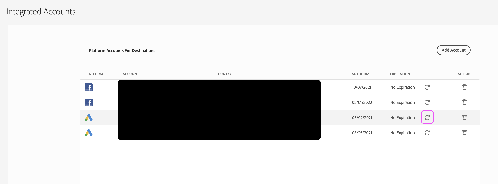

# Actualizar las credenciales de cuenta integradas

## Descripción

¿Está intentando asignar segmentos a un destino asociado con una cuenta integrada (como Facebook, Twitter o LinkedIn)? Este flujo de trabajo puede ser de ayuda.

## Resolución

Para completar estos pasos, debe tener acceso a la interfaz de usuario de AAM y a las credenciales de su cuenta integrada asociada.

1) Vaya a la página Cuentas integradas de administración en la interfaz de usuario de AAM y busque la cuenta.

2) Haga clic en el botón circular &quot;actualizar&quot; situado a la derecha de la cuenta en cuestión:

3) Según el tipo de cuenta, se le llevará a la plataforma asociada para completar el flujo de trabajo de actualización. Deberá introducir sus credenciales para la cuenta y completar los pasos adicionales que se le soliciten.

Si se producen errores, intente realizar el proceso una vez más después de borrar las cookies o la caché o utilizando un nuevo explorador de incógnito. También recomendamos utilizar Chrome en lugar de cualquier otro navegador para completar este proceso.
