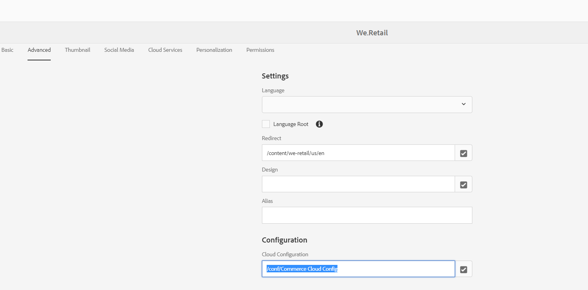

# AEM problema de integración del CIF. Los productos no se cargan en el cuadro de diálogo del componente principal del CIF.

## Descripción

Los productos no se cargan en el cuadro de diálogo de componentes principales del CIF. Según la documentación 0, el Commerce Cloud configura en AEM con el identificador de categoría raíz del catálogo como &quot;4&quot; en lugar de &quot;2&quot; (que es el valor predeterminado ) en el cuadro de diálogo de configuración de nube del CIF.  Pero cuando se verifica la solicitud de AEM a [!DNL Magento] Muestra la instancia `CategoryId` como &quot;2&quot; (defaultValue) en lugar de &quot;4&quot; debido a los cuales los productos no se cargan en el diálogo de componentes principales del CIF

0 [https://experienceleague.adobe.com/docs/experience-manager-65/commerce/storefront/getting-started.html?lang=en](https://experienceleague.adobe.com/docs/experience-manager-65/commerce/storefront/getting-started.html?lang=en)

## Resolución

Este problema puede ocurrir si la configuración del Commerce Cloud no está establecida en las propiedades de página en [!UICONTROL Avanzadas] pestaña . Normalmente, configure esta configuración de Commerce Cloud en la página raíz del sitio o en el nivel de página de aterrizaje en el árbol de contenido.

Para solucionar este problema, asegúrese de configurar la configuración del Commerce Cloud en &quot;[!UICONTROL Configuración de nube]&quot; en el campo [!UICONTROL Avanzadas] en las propiedades de la página como se muestra en la captura de pantalla siguiente.

