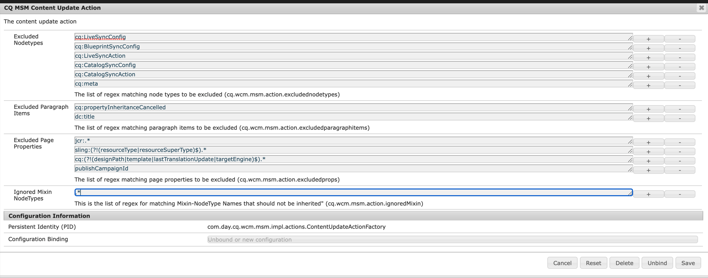
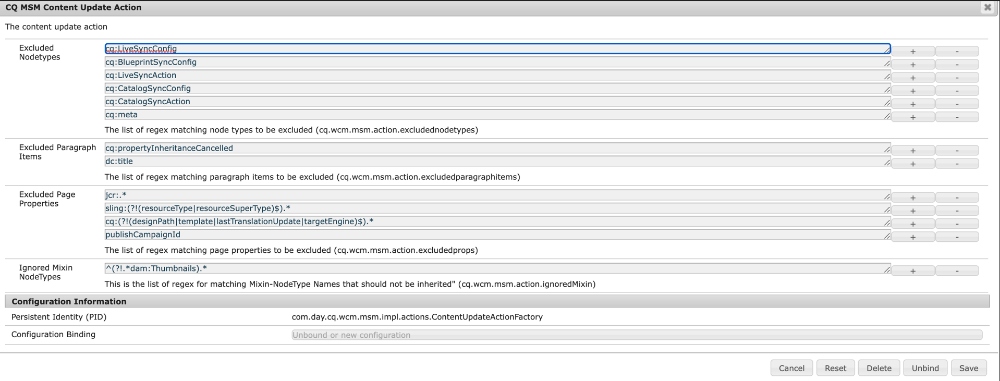

# Fallo en el despliegue debido a una mezcla conflictiva (y al uso de la IU clásica)

## Descripción


El despliegue de una página está fallando debido a algún conflicto *`jcr:mixinTypes`* en el nodo de miniaturas de la página.

El conflicto se produce cuando la página se configuró con una miniatura <b>uso de la IU clásica</b> y luego se implementó inicialmente (el primer despliegue funciona).

En este punto, hacer un despliegue de la página de formato está fallando debido a una mezcla conflictiva en la estructura de miniaturas de la página, entre:

- `dam:Thumbnails`
- `cq:LiveRelationship`


El error dado en el registro es el siguiente:


```
27.07.2022 15:48:07.091 *ERROR* 0:0:0:0:0:0:0:1 1658929687039 POST /bin/wcmcommand HTTP/1.1 com.day.cq.wcm.msm.impl.commands.RolloutCommand Error during roll-out.
com.day.cq.wcm.api.WCMException: com.day.cq.wcm.api.WCMException: com.day.cq.wcm.api.WCMException: com.day.cq.wcm.api.WCMException: com.day.cq.wcm.api.WCMException: com.day.cq.wcm.api.WCMException: javax.jcr.nodetype.ConstraintViolationException: No matching node definition found for dam:thumbnails
    at com.day.cq.wcm.msm.impl.RolloutManagerImpl.rolloutResource(RolloutManagerImpl.java:824) com.day.cq.wcm.cq-msm-core:5.11.84
    at com.day.cq.wcm.msm.impl.RolloutManagerImpl.rolloutPage(RolloutManagerImpl.java:693) com.day.cq.wcm.cq-msm-core:5.11.84
    at com.day.cq.wcm.msm.impl.RolloutManagerImpl.rolloutPageRelations(RolloutManagerImpl.java:624) com.day.cq.wcm.cq-msm-core:5.11.84
    at com.day.cq.wcm.msm.impl.RolloutManagerImpl.rollout(RolloutManagerImpl.java:515) com.day.cq.wcm.cq-msm-core:5.11.84
    at com.day.cq.wcm.msm.impl.commands.RolloutCommand.performCommand(RolloutCommand.java:153) com.day.cq.wcm.cq-msm-core:5.11.84
    at com.day.cq.wcm.core.impl.commands.WCMCommandService$CommandHolder.performCommand(WCMCommandService.java:178) com.day.cq.wcm.cq-wcm-core:5.11.312
    at com.day.cq.wcm.core.impl.commands.WCMCommandServlet.performCommand(WCMCommandServlet.java:120) com.day.cq.wcm.cq-wcm-core:5.11.312
    at com.day.cq.commons.servlets.AbstractCommandServlet.doPost(AbstractCommandServlet.java:49) com.day.cq.cq-commons:5.11.18
    at org.apache.sling.api.servlets.SlingAllMethodsServlet.mayService(SlingAllMethodsServlet.java:146) org.apache.sling.api:2.20.0
    at org.apache.sling.api.servlets.SlingSafeMethodsServlet.service(SlingSafeMethodsServlet.java:342) org.apache.sling.api:2.20.0
    ..
Caused by: com.day.cq.wcm.api.WCMException: com.day.cq.wcm.api.WCMException: com.day.cq.wcm.api.WCMException: com.day.cq.wcm.api.WCMException: com.day.cq.wcm.api.WCMException: javax.jcr.nodetype.ConstraintViolationException: No matching node definition found for dam:thumbnails
    at com.day.cq.wcm.msm.impl.RolloutManagerImpl.rolloutResource(RolloutManagerImpl.java:824) com.day.cq.wcm.cq-msm-core:5.11.84
    at com.day.cq.wcm.msm.impl.RolloutManagerImpl.rolloutResource(RolloutManagerImpl.java:811) com.day.cq.wcm.cq-msm-core:5.11.84
    ... 135 common frames omitted
Caused by: com.day.cq.wcm.api.WCMException: com.day.cq.wcm.api.WCMException: com.day.cq.wcm.api.WCMException: com.day.cq.wcm.api.WCMException: javax.jcr.nodetype.ConstraintViolationException: No matching node definition found for dam:thumbnails
    at com.day.cq.wcm.msm.impl.RolloutManagerImpl.rolloutResource(RolloutManagerImpl.java:824) com.day.cq.wcm.cq-msm-core:5.11.84
    at com.day.cq.wcm.msm.impl.RolloutManagerImpl.rolloutResource(RolloutManagerImpl.java:811) com.day.cq.wcm.cq-msm-core:5.11.84
    ... 136 common frames omitted
Caused by: com.day.cq.wcm.api.WCMException: com.day.cq.wcm.api.WCMException: com.day.cq.wcm.api.WCMException: javax.jcr.nodetype.ConstraintViolationException: No matching node definition found for dam:thumbnails
    at com.day.cq.wcm.msm.impl.RolloutManagerImpl.rolloutResource(RolloutManagerImpl.java:824) com.day.cq.wcm.cq-msm-core:5.11.84
    at com.day.cq.wcm.msm.impl.RolloutManagerImpl.rolloutResource(RolloutManagerImpl.java:811) com.day.cq.wcm.cq-msm-core:5.11.84
    ... 137 common frames omitted
Caused by: com.day.cq.wcm.api.WCMException: com.day.cq.wcm.api.WCMException: javax.jcr.nodetype.ConstraintViolationException: No matching node definition found for dam:thumbnails
    at com.day.cq.wcm.msm.impl.RolloutManagerImpl.rolloutResource(RolloutManagerImpl.java:824) com.day.cq.wcm.cq-msm-core:5.11.84
    at com.day.cq.wcm.msm.impl.RolloutManagerImpl.rolloutResource(RolloutManagerImpl.java:811) com.day.cq.wcm.cq-msm-core:5.11.84
    ... 138 common frames omitted
Caused by: com.day.cq.wcm.api.WCMException: javax.jcr.nodetype.ConstraintViolationException: No matching node definition found for dam:thumbnails
    at com.day.cq.wcm.msm.commons.BaseAction.execute(BaseAction.java:154) com.day.cq.wcm.cq-msm-commons:1.1.2
    at com.day.cq.wcm.msm.impl.RolloutManagerImpl.rolloutResource(RolloutManagerImpl.java:790) com.day.cq.wcm.cq-msm-core:5.11.84
    ... 139 common frames omitted
Caused by: javax.jcr.nodetype.ConstraintViolationException: No matching node definition found for dam:thumbnails
    at org.apache.jackrabbit.oak.plugins.nodetype.EffectiveNodeTypeImpl.getNodeDefinition(EffectiveNodeTypeImpl.java:454) org.apache.jackrabbit.oak-core:1.8.22
    at org.apache.jackrabbit.oak.plugins.nodetype.ReadOnlyNodeTypeManager.getDefinition(ReadOnlyNodeTypeManager.java:396) org.apache.jackrabbit.oak-core:1.8.22
    at org.apache.jackrabbit.oak.jcr.session.NodeImpl$29.perform(NodeImpl.java:1031) org.apache.jackrabbit.oak-jcr:1.8.22
    at org.apache.jackrabbit.oak.jcr.session.NodeImpl$29.perform(NodeImpl.java:1023) org.apache.jackrabbit.oak-jcr:1.8.22
    at org.apache.jackrabbit.oak.jcr.delegate.SessionDelegate.perform(SessionDelegate.java:207) org.apache.jackrabbit.oak-jcr:1.8.22
    at org.apache.jackrabbit.oak.jcr.session.ItemImpl.perform(ItemImpl.java:112) org.apache.jackrabbit.oak-jcr:1.8.22
    at org.apache.jackrabbit.oak.jcr.session.NodeImpl.getDefinition(NodeImpl.java:1023) org.apache.jackrabbit.oak-jcr:1.8.22
    at com.day.cq.wcm.msm.commons.ItemFilterImpl.excludes(ItemFilterImpl.java:91) com.day.cq.wcm.cq-msm-commons:1.1.2
    at com.day.cq.wcm.msm.impl.actions.ContentCopyActionFactory$ContentCopyAction.applyFilters(ContentCopyActionFactory.java:293) com.day.cq.wcm.cq-msm-core:5.11.84
    at com.day.cq.wcm.msm.impl.actions.ContentCopyActionFactory$ContentCopyAction.createCopy(ContentCopyActionFactory.java:245) com.day.cq.wcm.cq-msm-core:5.11.84
    at com.day.cq.wcm.msm.impl.actions.ContentCopyActionFactory$ContentCopyAction.doExecute(ContentCopyActionFactory.java:208) com.day.cq.wcm.cq-msm-core:5.11.84
    at com.day.cq.wcm.msm.commons.BaseAction.execute(BaseAction.java:134) com.day.cq.wcm.cq-msm-commons:1.1.2
    ... 140 common frames omitted
```


<b>Pasos a seguir:</b>

1. iniciar una vainilla AEM 6.5.13.0
2. vaya a <b>`/siteadmin`</b> (por lo que se usa <b>IU clásica</b>)
3. abra las propiedades de página de `/content/we-retail/language-master/en/women`
4. en la imagen *ficha* establecer cualquier imagen como miniatura
5. despliegue de la página
6. ahora vaya a <b>[!DNL Sites] IU</b>
7. abra las propiedades de página de `/content/we-retail/us/en/women` again
8. en el *[!UICONTROL Miniatura]* , haga clic en *[!UICONTROL Generar previsualización]* y guardar el cambio
9. ahora vuelva a desplegar la página en `/siteadmin`


## Resolución


Este problema se produce durante el despliegue porque AEM no puede crear `dam:thumbnails` nodo inferior `jcr:content` para la página de Live Copy (`/content/we-retail/us/en/women/jcr:content/image/file/jcr:content`) y el motivo de ello es durante el despliegue mixinType `dam:Thumbnails` no se aplica al nodo de página de Live Copy `/content/we-retail/us/en/women/jcr:content/image/file/jcr:content` y `dam:Thumbnails` La carpeta solo se puede crear a continuación `dam:Thumbnails` nodeType.

MSM El comportamiento predeterminado es ignorar la nueva mezcla añadida a los nodos en el origen durante el lanzamiento 0 y, por lo tanto, no se añade a `/content/we-retail/us/en/women/jcr:content/image/file/jcr:content`.

Para solucionar este problema, este comportamiento se puede cambiar mediante la configuración de acciones de actualización de contenido.
Se ignora por defecto cada tipo de mezcla como se muestra en la captura de pantalla siguiente:



Debe actualizarse para utilizar:


```
(?!.*dam:Thumbnails).*
```


como se muestra en la captura de pantalla siguiente:



Esto debería solucionar el problema.

0 https://experienceleague.adobe.com/docs/experience-manager-64/administering/introduction/msm-sync.html?lang=en#excluding-properties-and-node-types-from-synchronization
