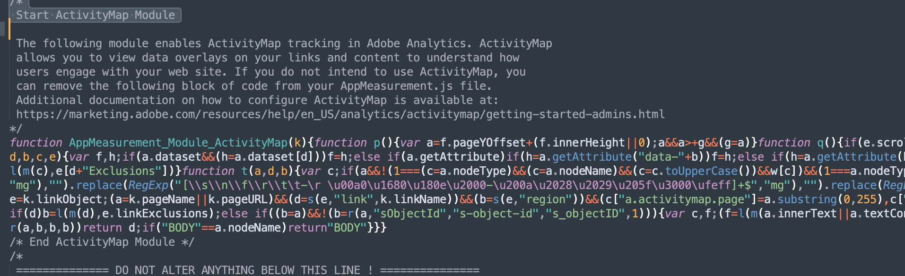
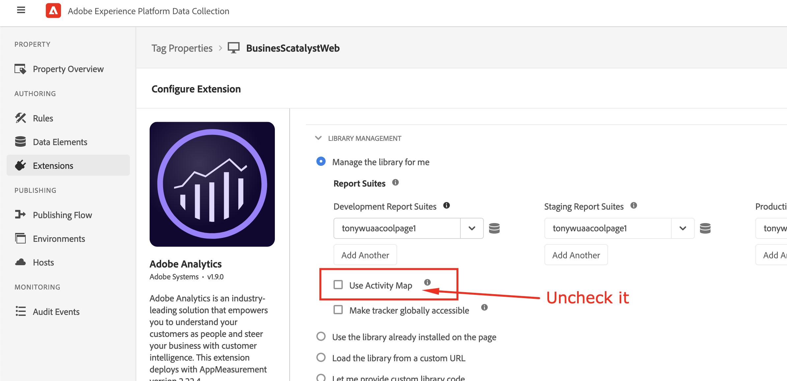
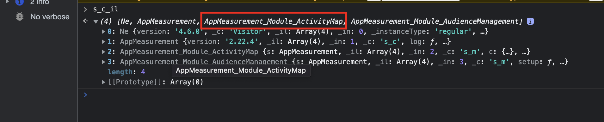
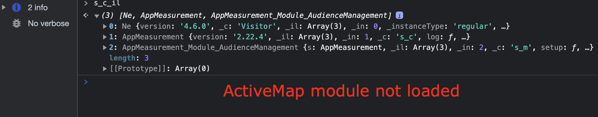
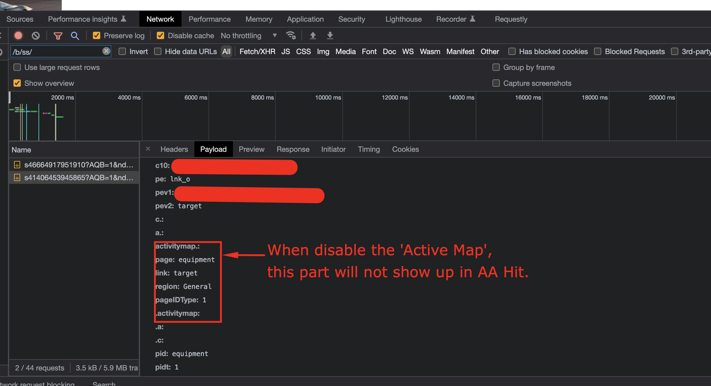

# ¿Cómo deshabilitar la recopilación de datos de Active Map?

## Descripción

Por alguna razón, ya no queremos recopilar datos de Active Map; ¿cómo se puede desactivar la recopilación de datos de Active Map?
  

## Resolución

- <b>Si la biblioteca de Adobe Analytics se administra en un servidor de cliente (AppMeasurement.js autoalojado )</b>

Elimine el módulo AppMeasurement_Module_ActivityMap del archivo AppMeasurement.js

- <b>Si la biblioteca de Adobe Analytics se administra en el Adobe (AppMeasurement.js se aloja mediante la CDN de Adobe)</b>

En la interfaz de usuario de la recopilación de datos de AEP (Launch), vaya a la configuración de la extensión de Adobe Analytics y deshabilite el Activity Map desmarcado en la casilla y, a continuación, publique la compilación

- 

- <b>Después de desactivar el mapa activo, marque el módulo de Active Map no se carga a través del menú &quot;consola&quot; del explorador mediante el comando &quot;s_c_il&quot;</b>

El módulo de Activity Map está cargado

El módulo de Activity Map no está cargado

- <b>Después de desactivar el mapa activo, compruebe la llamada al servidor de Adobe Analytics a través del menú &quot;red&quot; del explorador</b>.

