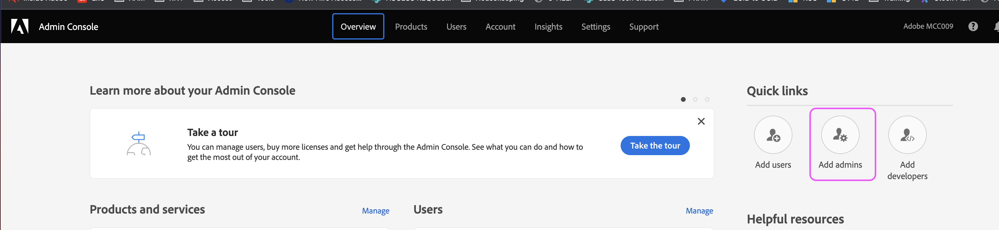
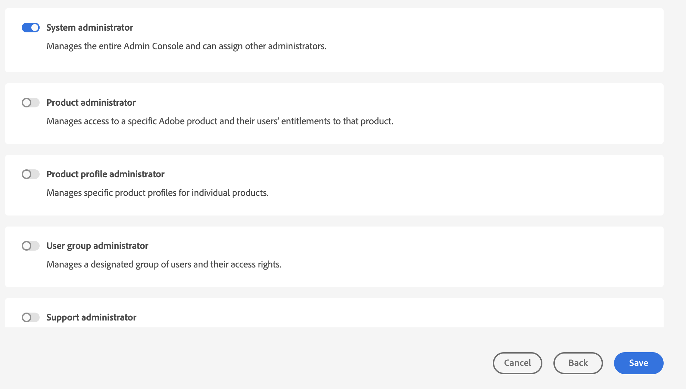
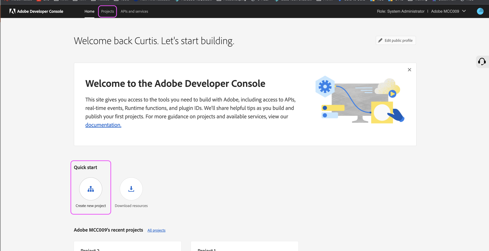
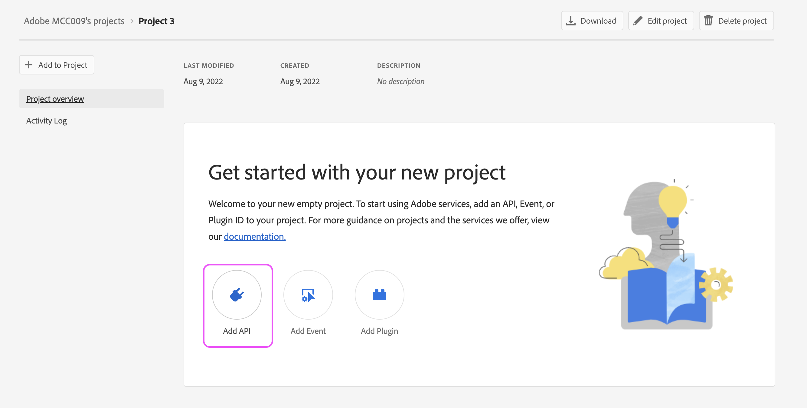
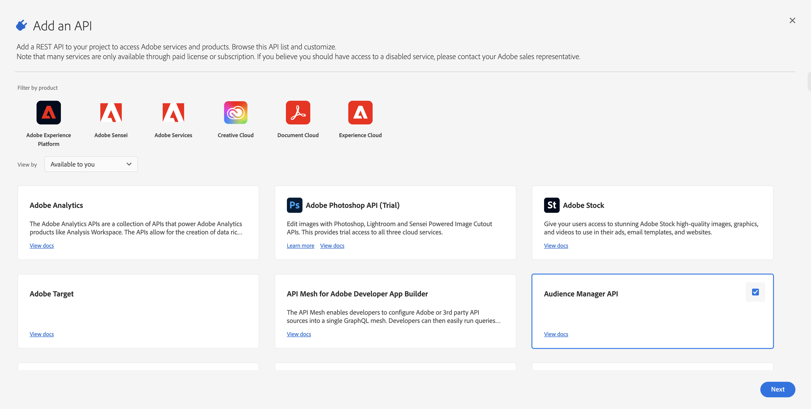
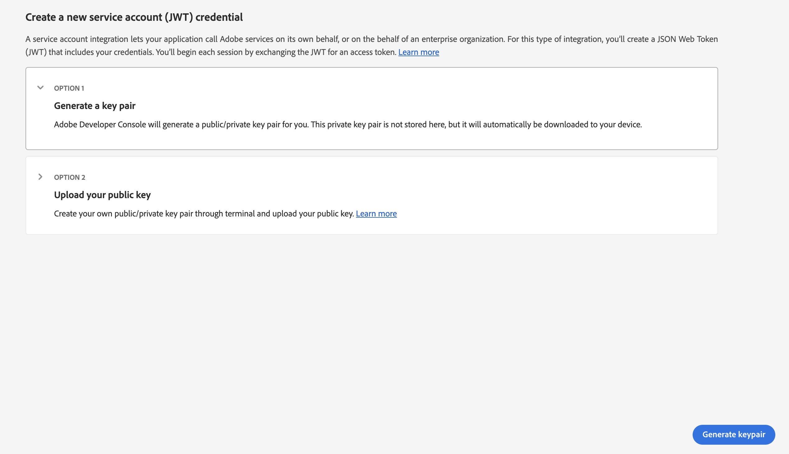
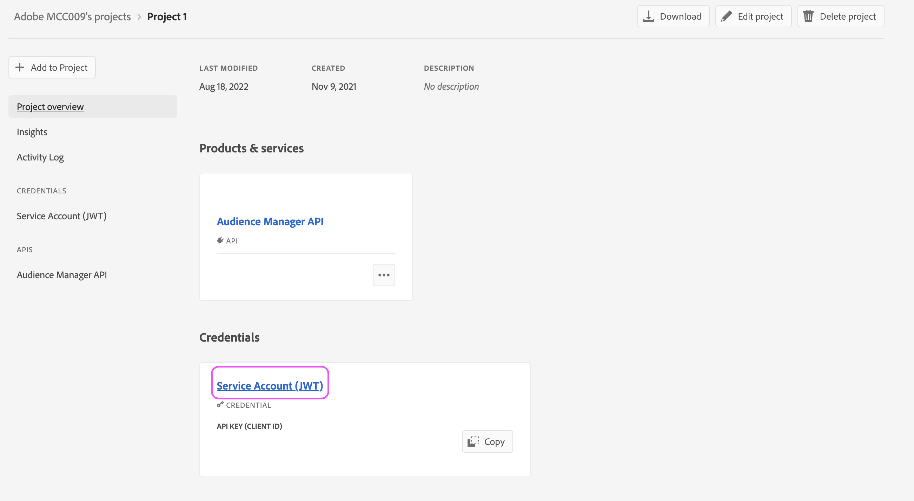
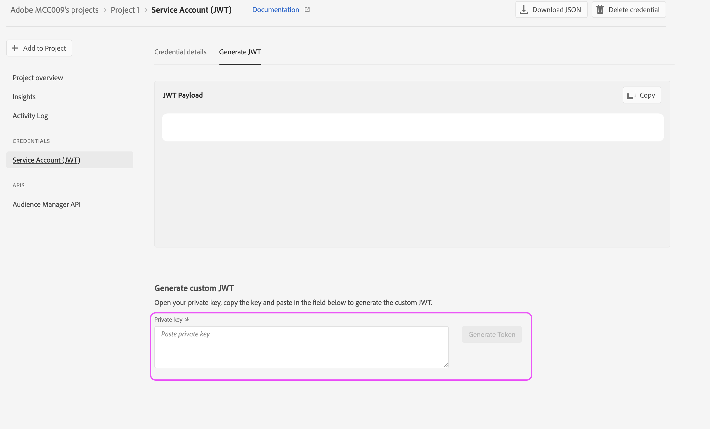
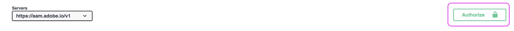
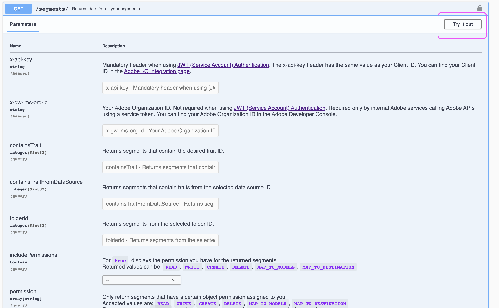

# Configuración AAM acceso a API

## Descripción

Este artículo describe cómo crear un proyecto en la consola de desarrollador para generar credenciales JWT de API de Audience Manager.

## Resolución

Necesitará permisos de administrador del sistema en el Admin Console para generar credenciales para la API de Audience Manager. Los pasos 1 y 2 describen cómo conceder estos permisos escalados. Es posible que los administradores actuales del sistema prefieran seguir estos pasos ellos mismos en lugar de conceder permisos de administrador escalados a un usuario adicional, en cuyo caso omita directamente el paso 3.

1. Vaya a la [Admin Console](https://adminconsole.adobe.com/) y seleccione [!UICONTROL Agregar administradores] de la variable [!UICONTROL Vínculos rápidos] menú:

   

1. Introduzca los correos electrónicos de todos los usuarios a los que desea conceder acceso. En la página siguiente, seleccione &quot;[!UICONTROL Administrador del sistema]&quot; para el nivel de permiso:

   

1. Vaya a [https://developer.adobe.com/console](https://developer.adobe.com/console) . Si todavía no tiene acceso a a pesar de que se le otorgaron derechos de administrador del sistema en los pasos anteriores, intente actualizar sus cookies/caché.

1. Cree un nuevo proyecto a partir de la variable [!UICONTROL Inicio rápido] (o [!UICONTROL Proyectos] en la barra de navegación superior):

   

1. Agregue la API de Audience Manager al proyecto:

   

   

1. Siga los pasos para generar (o cargar) sus credenciales de JWT. Si decide generar las credenciales a través de la consola de desarrollo, asegúrese de almacenar de forma segura la clave privada. Necesitará su clave privada en los pasos posteriores. 

   

1. A continuación, se le pedirá que asigne las credenciales a perfiles de producto relevantes. Si su organización utiliza controles de acceso basados en funciones, deberá seguir estos pasos para crear una cuenta de usuario técnica y agregarla al grupo RBAC correspondiente: [https://experienceleague.adobe.com/docs/audience-manager/user-guide/api-and-sdk-code/rest-apis/aam-api-getting-started.html?lang=en#technical-account-rbac-permissions](https://experienceleague.adobe.com/docs/audience-manager/user-guide/api-and-sdk-code/rest-apis/aam-api-getting-started.html?lang=en#technical-account-rbac-permissions)

1. Una vez completados estos pasos, puede generar un token de acceso para realizar su primera solicitud de API. En primer lugar, haga clic en la página de información general de sus credenciales en la consola de desarrollo:

   

1. Haga clic en la pestaña &quot;Generar JWT&quot; en la parte superior de la página y pegue toda la clave privada del archivo descargado en el paso 6 y haga clic en &quot;Generar token&quot;:

   

Por último, puede realizar solicitudes de API utilizando el token de acceso recuperado en el paso anterior. Las llamadas se pueden realizar desde cualquier plataforma de API, como [!DNL Postman], directamente a través de comandos cURL o incluso desde nuestra página de documentación de API: [https://bank.demdex.com/portal/swagger/index.html#/](https://bank.demdex.com/portal/swagger/index.html#/)

Para realizar llamadas mediante las funciones de demostración de nuestra documentación, siga los pasos anteriores para generar el token y, a continuación, haga clic en Autorizar en la parte derecha de la página e introduzca el token:

Asegúrese también de seleccionar el servidor aam.adobe.io , tal como se indica en la captura de pantalla anterior. Ahora, puede utilizar la función de demostración en cualquiera de las solicitudes de API introduciendo los parámetros relevantes y haciendo clic en el botón &quot;Probar&quot;:

Tenga en cuenta que esto enviará una solicitud de API real a su instancia. Si utiliza un `DELETE`, `PUT`o `POST` , puede que esté realizando cambios no deseados en su instancia. Asegúrese siempre de leer detenidamente la documentación de cada una de estas llamadas a la API antes de enviar la solicitud.

