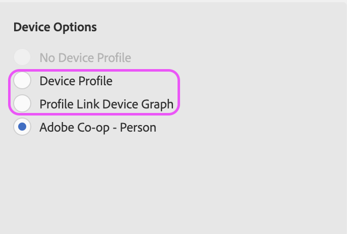

# Apertura de Device Co-op

## Descripción

A partir del 31 de agosto de 2022, device co-op quedará oficialmente obsoleto. Este artículo describe los impactos del cliente y los pasos necesarios. 

## Resolución

El trabajo de obsolescencia para device co-op comenzará el 31 de agosto de 2022. Aunque la opción para seleccionar la cooperación puede que no se elimine inicialmente de la interfaz de usuario, el gráfico del dispositivo de cooperación en sí se eliminará, por lo tanto, cualquier población de segmentos que utilice la cooperación puede experimentar una disminución notable en el tamaño. Recomendamos a todos los clientes que actualicen sus reglas de combinación de perfiles (PMR) antes del 31 de agosto de 2022.

Para actualizar los PMR, vaya a Reglas de combinación de perfiles de datos de audiencia y seleccione la regla en cuestión. En la parte inferior derecha de la página de información general de PMR, podrá actualizar la selección de opciones de dispositivo:

Seleccione &#39;[!UICONTROL Gráfico de dispositivos de vínculo de perfil]&#39; para continuar segmentando perfiles entre dispositivos, o &#39;Perfil del dispositivo&#39; para limitar la calificación al dispositivo actual. Más detalles sobre las diferencias entre estas dos opciones disponibles aquí: [https://experienceleague.adobe.com/docs/audience-manager/user-guide/features/profile-merge-rules/merge-rule-definitions.html?lang=en#device-options](https://experienceleague.adobe.com/docs/audience-manager/user-guide/features/profile-merge-rules/merge-rule-definitions.html?lang=en#device-options)

Si tiene problemas o conflictos al intentar actualizar su PMR, lo más probable es que se deba a los segmentos adjuntos y a los controles de exportación de datos asociados. En este caso, recomendamos crear una nueva PMR (póngase en contacto con el servicio de atención al cliente para proporcionar una nueva regla si está en el límite): [https://experienceleague.adobe.com/docs/audience-manager/user-guide/features/profile-merge-rules/merge-rules-start.html?lang=en#profile-merge-rule-setup](https://experienceleague.adobe.com/docs/audience-manager/user-guide/features/profile-merge-rules/merge-rules-start.html?lang=en#profile-merge-rule-setup)

A continuación, la herramienta BAAAM se puede utilizar para actualizar todos los segmentos relevantes desde el antiguo PMR de la cooperación a la regla recién creada: [https://experienceleague.adobe.com/docs/audience-manager/user-guide/reference/bulk-management-tools/bulk-management-intro.html?lang=en#actions-ops](https://experienceleague.adobe.com/docs/audience-manager/user-guide/reference/bulk-management-tools/bulk-management-intro.html?lang=en#actions-ops)

Si desea que se elimine la opción de cooperación de su interfaz de usuario, ajuste sus PMR como se describe más arriba y, a continuación, abra un ticket de atención al cliente para solicitar que se elimine la cooperación entre dispositivos. Además, no dude en abrir un ticket con cualquier pregunta o preocupación general relacionada con este artículo o con la desaprobación general de device co-op. También puede consultar nuestras preguntas frecuentes para obtener más información: [https://experienceleague.adobe.com/docs/device-co-op/using/about/device-co-op-eol.html?lang=en](https://experienceleague.adobe.com/docs/device-co-op/using/about/device-co-op-eol.html?lang=en)
