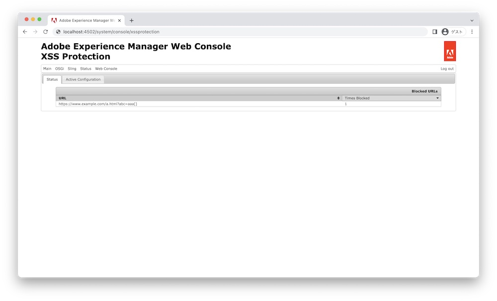

# Adobe Experience Manager: Comprobar las URL bloqueadas por la protección XSS

## Descripción

Puede encontrar una situación en la que AEM no procese una dirección URL de vínculo en una página. La protección XSS puede ser una causa en este caso. La protección XSS bloquea y elimina las direcciones URL no válidas que inducen XSS.
Este artículo describe cómo comprobar las URL bloqueadas por la protección XSS.

Protección XSS https://experienceleague.adobe.com/docs/experience-manager-65/developing/introduction/security.html

<b>Entornos</b>
AEM 6.5

## Resolución

Puede comprobar las direcciones URL bloqueadas de la siguiente manera:
1. Vaya a Protección Sling XSS de la consola web (o acceda a http://localhost:4502/system/console/xssprotection)
2. Compruebe los valores &quot;URL&quot; y &quot;Times Blocked&quot; en URL bloqueadas en la pestaña Status

