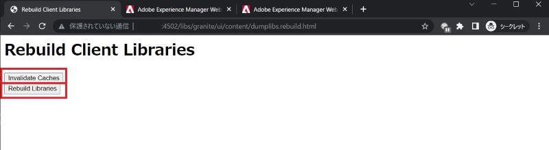
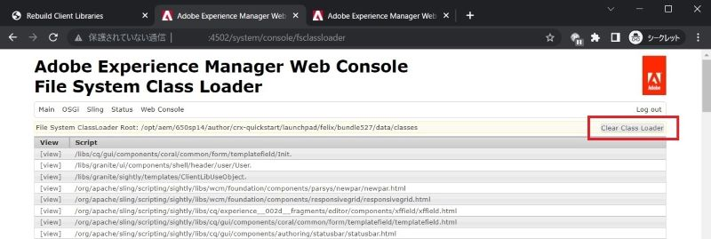
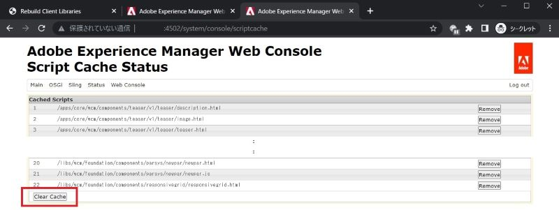

# Adobe Experience Manager: Cómo borrar la caché de HTL/JSP/JS/CSS para los componentes personalizados

## Descripción

Al modificar los archivos HTL/JSP/JS/CSS para el componente personalizado, AEM podría no reflejar inmediatamente las modificaciones de las páginas con el componente. En este caso, la caché interna puede ser una causa.
Este artículo explica cómo borrar la caché de estos archivos.

<b>Entorno:</b>
AEM 6.5

## Resolución

Puede borrar la caché mediante las siguientes funciones.

\* Bibliotecas de cliente: Archivos JS/CSS

Reconstruya bibliotecas de cliente > Invalidar cachés o Reconstruir bibliotecas http://localhost:4502/libs/granite/ui/content/dumplibs.rebuild.html 
     

\* Cargador de clases del sistema de archivos: JSP, HTL

Consola Web > Sling > File System Class Loader > Clear Class Loader http://localhost:4502/system/console/fsclassloader
     

\* Caché de script: HTL, archivo JS

Consola Web > Sling > Estado de caché de script > Borrar caché http://localhost:4502/system/console/scriptcache
     

Se recomienda limpiar la caché en un momento tranquilo para evitar la degradación del rendimiento.
También es posible que tenga que comprobar la caché de Dispatcher y la caché del explorador.
