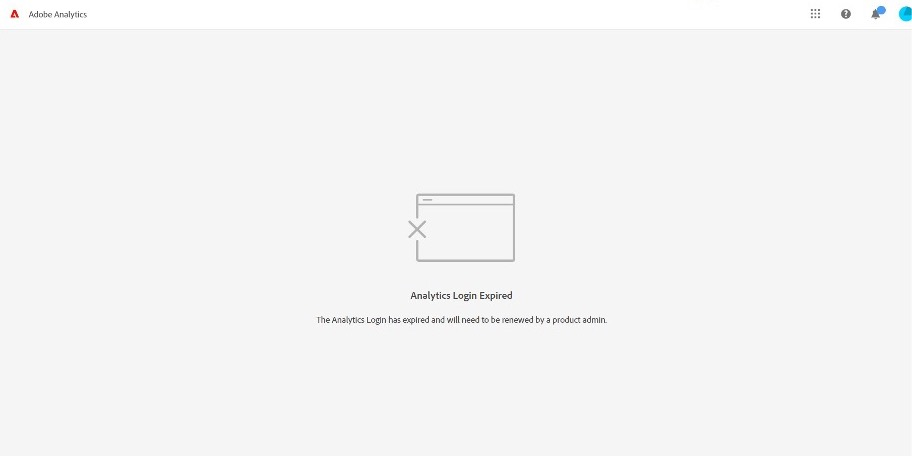
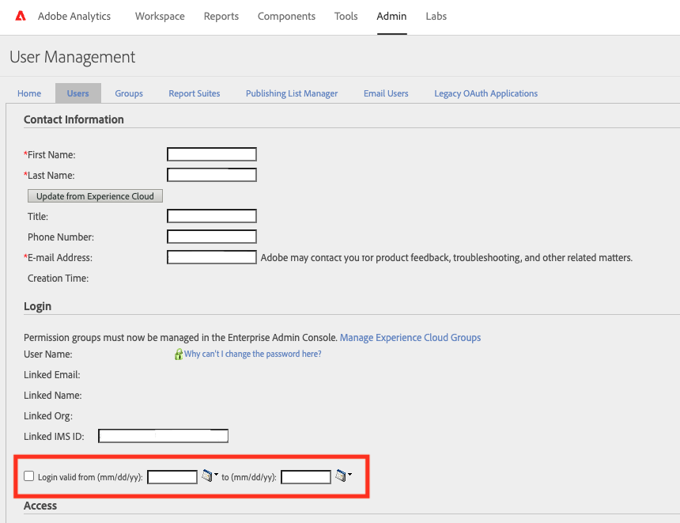

# No se puede acceder a Adobe Analytics debido a que el inicio de sesión de Analytics ha caducado.

## Descripción

Aparece el siguiente mensaje de error al acceder a Adobe Analytics.
  
 El inicio de sesión de Analytics expiró
 El inicio de sesión de Analytics ha caducado y un administrador de productos deberá renovarlo.
    

## Resolución

Esto ocurre porque la fecha actual reside fuera del intervalo de fechas válido para la cuenta. Trabaje con un administrador de Analytics de su organización para ampliar el intervalo de fechas válido del inicio de sesión. El servicio de asistencia al cliente de Adobe no está autorizado a cambiar los intervalos de fechas de inicio de sesión válidos para las cuentas de usuario.

1. Como administrador de Analytics, vaya a Recursos y usuarios de Adobe Analytics Admin Analytics
2. Seleccionar un ID de usuario en cuestión
3. En la ventana Administración de usuarios, amplíe el intervalo de fechas válido &#39;Usuario válido desde (mm/dd/aa):&#39; y &#39;hasta (mm/dd/aa):&#39;. O, simplemente desmarque la casilla de verificación.

・Inicios de sesión caducados
[https://experienceleague.adobe.com/docs/analytics/technotes/troubleshoot-login.html?lang=en#expired-logins](https://experienceleague.adobe.com/docs/analytics/technotes/troubleshoot-login.html?lang=en#expired-logins)
