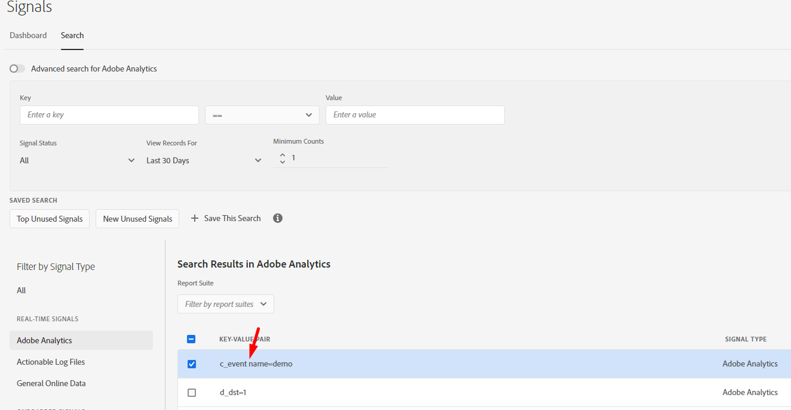

# Error al crear un nuevo rasgo desde el panel de señales

## Descripción

Al crear un nuevo rasgo a partir de señales presentes en el panel de señales, aparece el siguiente error:

La señal que estoy tratando de usar es:

## Resolución

El error indicado indica que la clave de la señal solo puede contener comillas dobles (&quot;), puntos (.), guiones (-) y guiones bajos (_).

Al observar las señales de cerca, se identificó que contiene un espacio como se resalta a continuación debido al cual la validación de características estaba fallando.

La selección de la condición de señal correcta es muy importante.

Referencias:

Reglas de rasgos- [https://experienceleague.adobe.com/docs/audience-manager/user-guide/features/traits/trait-builder/manage-trait-rules.html?lang=en](https://experienceleague.adobe.com/docs/audience-manager/user-guide/features/traits/trait-builder/manage-trait-rules.html?lang=en)

Requisitos de nombre [https://experienceleague.adobe.com/docs/audience-manager/user-guide/features/traits/trait-key-name-requirements.html?lang=en](https://experienceleague.adobe.com/docs/audience-manager/user-guide/features/traits/trait-key-name-requirements.html?lang=en)
