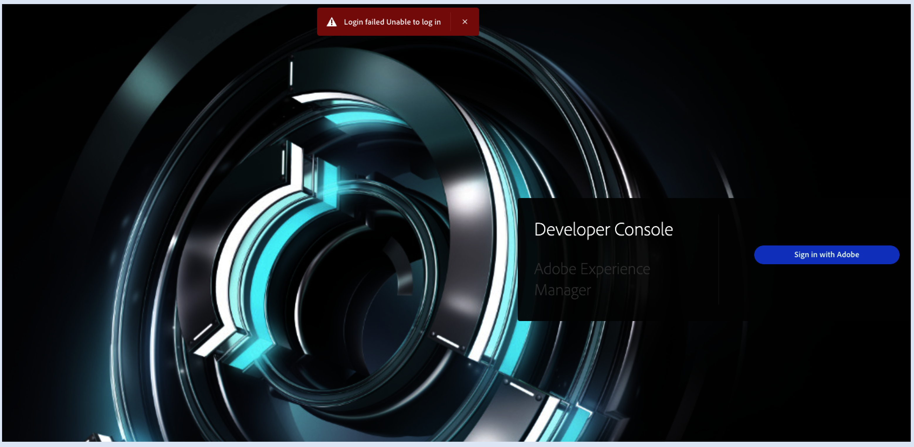

# El equipo no puede acceder a AEM Developer Console en todos los entornos

## Descripción

El cliente ha observado que no puede acceder a la consola de desarrollador de AEM para todos los entornos aunque tenga todos los permisos: Desarrollador, función de administrador y Administrador de programas

## Resolución

Desde la captura de pantalla, se puede ver que las funciones se han proporcionado a través de un grupo de usuarios: &quot;<b>Asignado por el grupo de usuarios user_group_name</b>&quot;.
Los grupos anidados no son compatibles con AEM as a Cloud Service.

Los permisos de producto asignados a través de grupos de usuarios de IMS deben ser compatibles con AEM as a Cloud , pero IMS no siempre es fiable con la herencia y este es un problema que ya se ha planteado internamente.

Por lo tanto, para que los usuarios puedan acceder a Developer Console, elimine las funciones del grupo de usuarios y asígnelas directamente a los usuarios.
