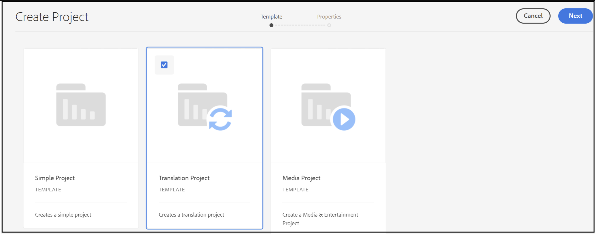
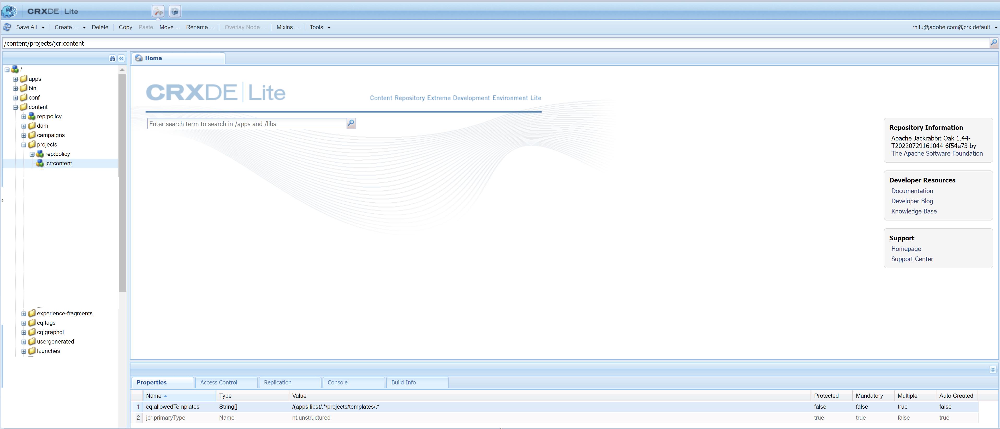

# No hay ninguna plantilla de proyecto disponible

## Descripción

Aunque el usuario del cliente tiene todos los privilegios necesarios asignados en el Admin Console, incluidos los derechos de administrador, al intentar crear un nuevo proyecto desde *Inicio de AEM - Proyectos - Crear - Proyecto* no hay ninguna plantilla de proyecto disponible, por lo que no se puede crear ningún proyecto.   
Según 1, AEM se envía con tres plantillas diferentes fuera de la caja:

- Un proyecto sencillo: una muestra de referencia para los proyectos que no se ajustan a otras categorías (una plantilla global). Incluye tres funciones básicas (propietarios, editores y observadores) y cuatro flujos de trabajo (Aprobación del borrador, Solicitud de lanzamiento, Solicitud de página de aterrizaje y Solicitud de correo electrónico).
- Un proyecto de medios: un proyecto de muestra de referencia para las actividades relacionadas con medios. Incluye varias funciones de proyecto relacionadas con los medios (fotógrafos, editores, redactores, diseñadores, propietarios y observadores).
- A [proyecto de traducción](https://experienceleague.adobe.com/docs/experience-manager-cloud-service/content/sites/administering/reusing-content/translation/overview.html?lang=en) - Una muestra de referencia para administrar las actividades relacionadas con la traducción. Incluye tres funciones básicas (propietarios, editores y observadores). Incluye dos flujos de trabajo a los que se accede en la interfaz de usuario Flujos de trabajo.

      Sin embargo, el cliente no puede ver ninguna de estas plantillas.     1 [https://experienceleague.adobe.com/docs/experience-manager-cloud-service/content/sites/authoring/projects/overview.html?lang=en#project-templates](https://experienceleague.adobe.com/docs/experience-manager-cloud-service/content/sites/authoring/projects/overview.html?lang=en#project-templates)

## Resolución

Para que las plantillas de proyecto estén visibles en AEM, la propiedad - <b>cq:allowedTemplates</b> de tipo <b>Cadena</b> y el valor <b>/(apps|libs)/.\*/proyectos/plantillas/.\&lt;/b>* debe estar presente en <b>/content/projects/jcr:content</b>.

Se encontró que el problema se debía al hecho de que el cliente no tenía ningún nodo jcr:content en /content/projects. Después de crear el nodo jcr:content y agregar el atributo cq:allowedTemplates , el cliente puede ver las tres plantillas de proyecto.

